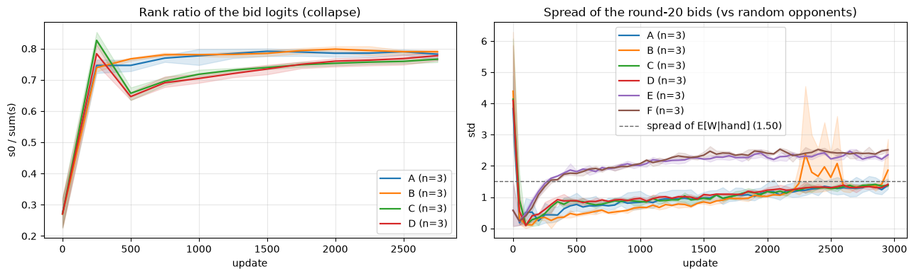
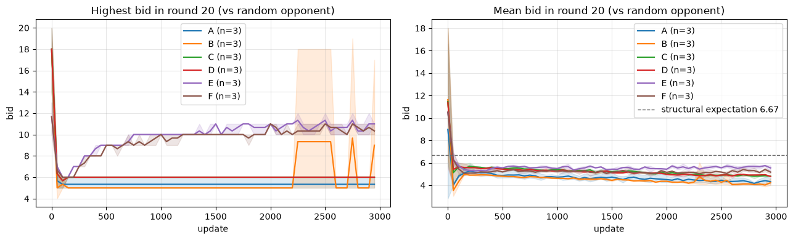
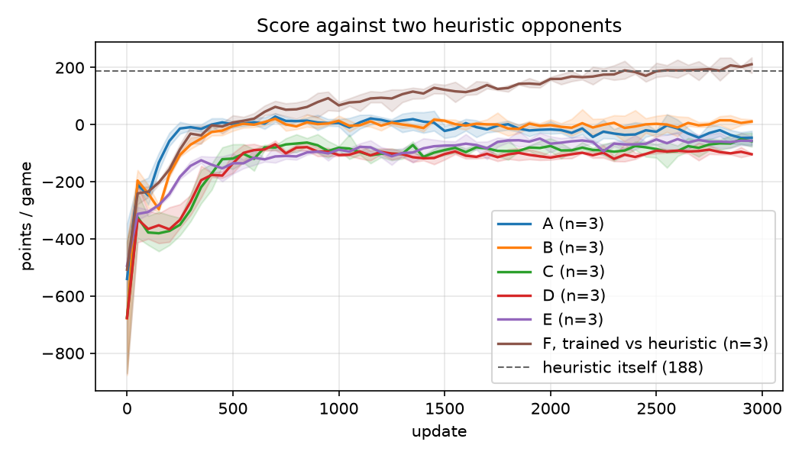
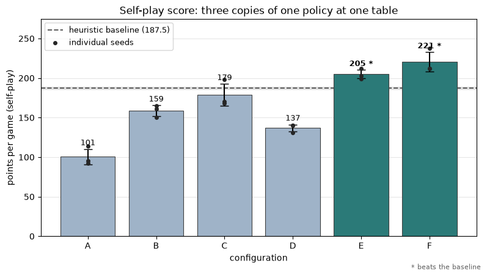
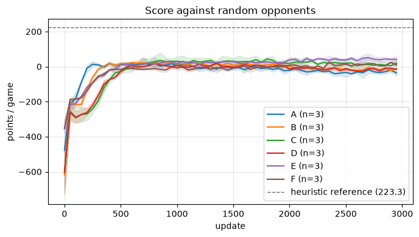
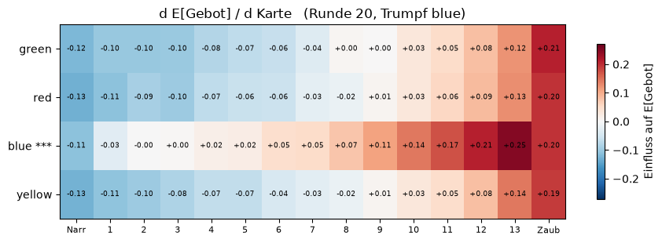
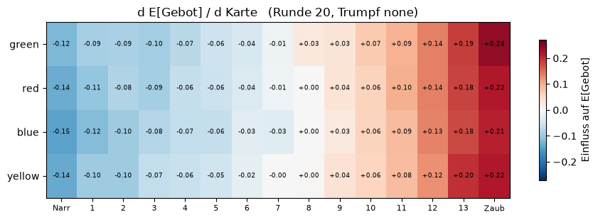

# Self-Play Reinforcement Learning for Wizard

This project trains an agent to play **Wizard**, a trick-taking card game in which
players must first *announce* how many tricks they will win and then play to hit
that number exactly. Environment, observation encoding, training loop and
diagnostics are implemented from scratch in Python and PyTorch.

The agent learns to play competently and beats random opponents. The main problem was, however, that the **bidding policy collapses**: within a few hundred updates it stopped distinguishing
between hands and never announces more than 6 tricks in a 20-card round, where
the structural expectation is 6.67. Most of this work focused on identifying why and solving the problem,
through **five training configurations of increasing complexity**, each one a
response to a specific failure diagnosed in the previous. The final configuration
removes the ceiling by replacing the learned bidding policy with a supervised
trick-count predictor and an analytic decision rule. This solved the bidding problem, yet the overall performance against the heuristic agent baseline leaves room for further improvement.

**[▶ Play against the trained agent](#how-to-run)**

---

## Context

### The game

60 cards: four suits of thirteen, four **wizards** (win any trick) and four
**fools** (lose any trick). Three players play 20 rounds; round *r* deals *r*
cards each. Every round has two phases — **bid**, then **play**.

Scoring gives no partial credit:

$$
\text{points}(b, w) =
\begin{cases}
20 + 10b & b = w \\
-10\,|b - w| & b \neq w
\end{cases}
$$

where $b$ is the announced bid and $w$ the tricks actually won. Bidding 7 and
taking 6 scores worse than bidding 6 and taking 6. The last bidder may not choose
a value that makes all bids sum to $r$, so at least one player is always forced
to miss.

### As a reinforcement learning problem

| Property | Consequence |
|---|---|
| **Imperfect information** | Opponents' hands are hidden; only their bids and played cards are observable. |
| **Two coupled decisions, one reward** | The round return depends jointly on one bid and up to 20 card decisions. A single scalar must be split across both. |
| **Sparse, delayed reward** | Nothing is observed until the round ends, up to 20 tricks after the bid. |
| **The task changes shape** | A 1-card and a 20-card round are structurally different problems, and each round size is seen equally rarely. |
| **Self-play non-stationarity** | The opponents improve as the agent does, so the distribution being fitted moves underneath it. |

The bid is the hard part. It is a **single decision whose consequence is
determined by 20 later decisions**, in a game where the reward function punishes
near-misses as harshly as wild ones. Card play, by contrast, receives dense and
well-conditioned feedback.

---

## Method

### Observation encoding

A 317-dimensional vector per decision:

| Block | Dims | Content |
|---|---|---|
| hand | 60 | multi-hot over the deck |
| played | 60 | cards already played this round |
| trump | 5 | one-hot, including "no trump" |
| current trick | 180 | 3 × 60, by play order |
| bids and tricks won | 9 | 3 × (bid, won, has-bid flag) |
| meta | 3 | round size, bidding position, bid/play flag |

Player-indexed fields are encoded **relative to the acting player**, so a strategy
learned in one seat transfers to the others instead of being relearned per seat.

### Architecture

A shared trunk (317 → 256 → 256, ReLU) NN with four linear heads:

| Head | Output | Objective |
|---|---|---|
| bid | 21 | policy gradient |
| play | 60 | policy gradient |
| value | 1 | MSE against the round return |
| tricks | 21 | cross-entropy against observed tricks won |

Illegal actions are masked to $-\infty$ before the softmax, so the policy cannot
break the rules and spends no capacity learning them.

### Training and evaluation

REINFORCE with a learned value baseline (advantage actor-critic), Monte-Carlo
returns, $\gamma = 1$. Three copies of the current network play each other. One
update collects 20 games ≈ 13,800 transitions, of which ~1,200 are bids (later on this was increased to 30 games).

Evaluation runs every 50 updates on a **fixed seed with the RNG state saved and
restored**, so identical deals are replayed at every measurement point and
differences are attributable to the network rather than to the cards. See section [Results](#results).

---

## Experiments

Six configurations, each adding one mechanism to the previous one. Self-play
score is points per game at a table of three copies of the same policy —
directly comparable to the heuristic's 187.5, and the only axis no
configuration can have trained towards.

| | adds | motivated by | self-play |
|---|---|---|---|
| **0** | Heuristic baseline | — | **187.6** |
| **A** | REINFORCE + per-head entropy bonus | — | 100.5 |
| **B** | + learned value baseline | return variance suspected as the cause | 158.7 |
| **C** | + `r²`-weighted round sampling | too few bid samples per round size | 178.7 |
| **D** | + trick-count head as auxiliary loss | trunk under-represents hand strength | 137.0 |
| **E** | + expected-value bidding rule | the bid is a prediction, not a control problem | **204.8** |
| **F** | + heuristic opponents during training | self-play teaches one opponent distribution only | **220.6** |

The bid ceiling in 20-card rounds is the thread running through A to D: none of
them ever bids above 6, where the structural expectation is 6.67. C and D
improve the machinery around a bid that still cannot be announced.

### A — where the ceiling comes from

Never bids above 6 in 20-card rounds; expectation is 6.67. Self-play 100.5.

An unsampled class gets gradient $\partial L/\partial z_k = A \cdot p_k$,
proportional to its own vanishing probability. But Adam divides by the gradient's
running RMS, so the step stays at learning-rate scale: class 18 gets a gradient
1700× smaller than class 5 and a step of the same size. The upper classes are not
frozen, they random-walk on numerical noise — which is why the highest bid
occasionally jumps to 18 for a few hundred updates and falls back.



### B — Value baseline

Ceiling unchanged, but the biggest single gain in the ablation: self-play
100.5 → 158.7, hit rate 0.330 → 0.374.

Round returns span −200 to +220, mostly card luck. A state-conditional baseline
$A = G - V(s)$ removes that variance. It cannot help the ceiling — a better
baseline still produces no gradient for an action that is never sampled.

### C — Weighted round sampling

Ceiling still unchanged. Self-play 178.7.

Bid classes are absolute: bidding 1 in a 3-card round teaches nothing about
bidding 7 in a 20-card round, and each round size gets only ~60 bids per update.
Training exclusively on 18+ card rounds removes the ceiling immediately, so the
constraint is data, not optimisation. But $r^2$ sampling gives round 20 just 2.8×
more samples where that test had 20× — not enough to move it.



*A–D never leave the 5–6 band, E and F reach 11. The right panel is measured
against random opponents — see [Results](#results) for why that matters.*

### D — trick prediction as an auxiliary task

Prediction error at bid time 6.5 → 1.4 tricks. Self-play **drops** to 137.0.

The scoring rule is known analytically, so the only unknown is how many tricks a
hand takes — and that is observed every round regardless of what was bid. A
fourth head predicts $p(w = k \mid s)$ with gradient $q_k - \mathbb{1}[k=w]$: no
$p_k$ factor, so an improbable but correct class gets the *largest* update. As a
pure auxiliary loss it costs trunk capacity and the bid policy gains nothing.
D is a regression that enables E.

### E — the bid becomes arithmetic

Ceiling gone: 39 % of round-20 bids land at 7+, against 0 % in A–D. Self-play
**204.8**, above the heuristic's 187.5.

With $q$ predicted and the scoring rule known, no policy is needed:

$$\text{EV}(b) = q_b\,(20 + 10b) \;-\; 10\sum_k q_k\,|b - k|$$

A bid of 10 can be output without ever having been played, because the class is
computed. Calibration follows: at a table of three copies of itself the agent
bids **6.67** against an expectation of 6.67.

### F — opponent diversity

Bias against the heuristic +1.15 → +0.20, bid quality at parity. Self-play
**220.6**, best of the ablation.

Self-play teaches the bid to condition on the opponents' announcements — a real
signal, learned for exactly one opponent distribution. E therefore bids 5.7
against random (who announce 10), 7.0 against copies of itself, and 7.3 against
the under-bidding heuristic, losing that table with −82. Mixing heuristics into
training at `p_heur = 0.4` widens the distribution. Not overfitting: self-play
score, where no heuristic appears, is the highest in the grid.

<p align="center">
  
</p>

*F trained against this opponent — valid for "beats the reference", not for
"generalises".*

---

## Results

Three seeds per configuration, 3000 updates each. Error bars are the spread
between seeds, not measurement error.

### Self-play — the primary axis

Three copies of one policy at one table, averaged over all three seats, 600
games per seed. No foreign opponent takes part, so no configuration can have
trained towards this number.

| | points | seed spread | hit rate | MAE | individual seeds |
|---|---:|---:|---:|---:|---|
| **heuristic** | **187.5** | ±1.3 | 0.370 | 0.921 | *baseline* |
| A | 100.5 | ±9.6 | 0.330 | 1.038 | 114 · 92 · 95 |
| B | 158.7 | ±6.7 | 0.374 | 0.972 | 150 · 161 · 165 |
| C | 178.8 | ±13.8 | 0.332 | 0.947 | 198 · 170 · 168 |
| D | 137.0 | ±4.2 | 0.298 | 1.020 | 131 · 140 · 140 |
| **E** | **204.8** | ±5.4 | 0.365 | 0.849 | 203 · 212 · 199 |
| **F** | **220.6** | ±12.1 | 0.382 | **0.819** | 212 · 212 · 238 |

E and F beat the baseline, every individual seed included. F matches the
heuristic's hit rate (0.382 vs 0.370) at a smaller error (0.819 vs 0.921).

<p align="center">
  
</p>

### The other axes

| | vs random | vs heuristic | tricks MAE @ r20 |
|---|---:|---:|---:|
| A | −36.3 ±12.8 | −45.9 ±20.2 | 3.49 ±1.0 |
| B | −13.6 ±6.8 | 10.9 ±5.2 | 4.47 ±2.1 |
| C | 20.0 ±12.9 | −58.0 ±20.6 | 6.47 ±3.3 |
| D | −14.0 ±1.7 | −103.6 ±2.2 | 1.37 ±0.1 |
| E | 41.3 ±16.4 | −56.7 ±14.0 | 1.35 ±0.0 |
| F | 9.3 ±10.1 | 211.2 ±22.8 | 1.30 ±0.1 |

F's score against the heuristic is not independent — it trained against that
opponent with `p_heur = 0.4`. The number is valid for "beats the reference",
not for "generalises to unseen opponents"; the self-play table answers the
latter.


### The evaluation opponent determines the conclusion

The most consequential finding was not about the agent but about how it was
measured.

| measured against | opponents bid | agent bids | agent wins | bias |
|---|---:|---:|---:|---:|
| 2× random | 10.20 | 5.20 | 6.97 | −1.77 |
| 2× heuristic | 5.35 | 7.00 | 6.89 | +0.10 |
| **2× copies of itself** | 6.63 | **6.67** | 6.71 | **−0.05** |

`RandomAgent` bids uniformly over 0..r, so in round 20 each opponent announces
about 10 of the 20 available tricks. The agent reads those bids from its
observation and correctly concludes little is left for it. Broken down by
bidding position: 6.78 as first bidder, 5.39 as second, 3.45 as last — the
effect appears exactly as the opponents' bids enter the observation.

For a year of curves, `bids/mean_r20` on the random axis therefore looked like a
calibration failure. The same network bids the structural expectation to two
decimals against copies of itself. What it had learned was not a bad bid but a
correct inference from a nonsensical input.

A second measurement artefact sat in the same place. `game.start()` derives the
first bidder from the round index, so in round 20 the bidding order is always
[1, 2, 0] and seat 0 is always the player the screw-the-dealer rule restricts.
Three identical heuristics over 500 games: hit rate 0.260 on seat 0 against
0.342 on seat 2. Every round-20 figure in earlier versions of this document
carried that penalty.

<p align="center">
  
  
</p>

## What the agent learned

Three probes of the trained network, none of which involve a score.

**Card values.** The agent learns what a card is worth, and the values respond to trump exactly as they should. Value rises with rank. Under `trump = blue` the blue cards sit clearly above the rest; under `trump = none` all four suits collapse onto the same level. Wizards are always highest, fools always lowest. None of this is in the training signal — the agent only ever sees the round's final score.
<p align="center">
  
  
</p>

**Opponent-conditioned bidding.** Already shown in the tables above: the bid shifts in the right direction with the opponents' announcements — up against the under-bidding heuristic, down against random. The mechanism is learned from self-play and transfers correctly only to opponents that bid similarly.

---

## Lessons learned

- **The evaluation opponent decides the conclusion.** Random opponents bid ~10 in
  round 20, so the agent correctly bids down — and looked miscalibrated for
  thousands of updates. Against copies of itself it hits the structural
  expectation exactly.
- **A collapsed action class is a gradient-flow problem, not a hyperparameter
  one.** No learning rate or entropy weight revives a class whose gradient is
  proportional to its own vanishing probability — but under Adam it is not frozen
  either, it drifts at full learning rate on noise.
- **Probe the frozen model.** Synthetic hands, linear probes and gradient
  attribution over the 60 card inputs found blind spots no training curve showed.

## Planned work

- **Splitting the remaining gap.** Hybrid agents, RL bidding with heuristic
  play and vice versa, to attribute what is still missing to the bid or to the
  card play. Bid quality is already at parity (corr 0.884 vs 0.881); the fine
  control that turns "near the bid" into "exactly the bid" is not.
- **Denser play signal.** One scalar reward per round over up to 20 card
  decisions cannot teach "win exactly one more trick". A per-trick auxiliary
  loss, or a penalty for tricks taken beyond the announced bid.
- **Round-robin among the 18 checkpoints.** No configuration trained against
  another, so every pairing is an unseen opponent.
---

## Repository Structure

```
wizard-rl/
├── cards.py                  # deck, card representation, ordering
├── game.py                   # rules engine, round loop, scoring
├── tricks.py                 # trick resolution (wizard / fool / trump / follow suit)
├── observations.py           # 317-dim encoding, relative to the acting player
├── model.py                  # shared trunk + bid / play / value / tricks heads
├── player.py                 # RLAgent, RandomAgent, HeuristicAgent, HumanAgent
├── heuristic_agent.py        # bidding tables + trick helpers for HeuristicAgent
├── train.py                  # self-play loop, loss, evaluation, TensorBoard logging
├── play.py                   # CLI: play a game against a trained checkpoint
├── model_analysis.ipynb      # probing, gradient attribution, rank test
├── relevant_checkpoints/     # trained weights
├── docs/
│   ├── investigation.md      # full derivations behind the Experiments section
│   └── figures/
├── tests/                    # pytest invariants for the rules engine
├── requirements.txt
└── README.md
```


## How to Run

### Install

```bash
git clone https://github.com/JonathanSierks/wizard-rl.git
cd wizard-rl
python3 -m venv .venv && source .venv/bin/activate
pip install -r requirements.txt
```

### Play against the agent

```bash
python main.py
```

Deals a full game against two copies of the trained agent from configuration F. Your hand is shown with card indices; you enter a bid and then an index per trick. Illegal choices
are rejected with the reason.

### Train from scratch

```bash
python train.py
tensorboard --logdir rl_runs --port 6006
```

| Flag | Default | Purpose |
|---|---|---|
| `--config` | `ev` | Configuration A–E (`baseline`, `value`, `sampling`, `aux`, `ev`) |
| `--seed` | `0` | Random seed |
| `--updates` | `3000` | Number of self-play updates |
| `--tag` | — | Suffix appended to the run directory name |


## References

- Williams, R. J. (1992). *Simple statistical gradient-following algorithms for
  connectionist reinforcement learning*. Machine Learning 8, 229–256.
- Mnih, V., et al. (2016). *Asynchronous methods for deep reinforcement learning*.
  ICML, 1928–1937.
- Alain, G., & Bengio, Y. (2016). *Understanding intermediate layers using linear
  classifier probes*. arXiv:1610.01644.
- Ribeiro, M. T., et al. (2020). *Beyond accuracy: Behavioral testing of NLP models
  with CheckList*. ACL, 4902–4912.
- Jaderberg, M., et al. (2017). *Reinforcement learning with unsupervised auxiliary
  tasks*. ICLR.
